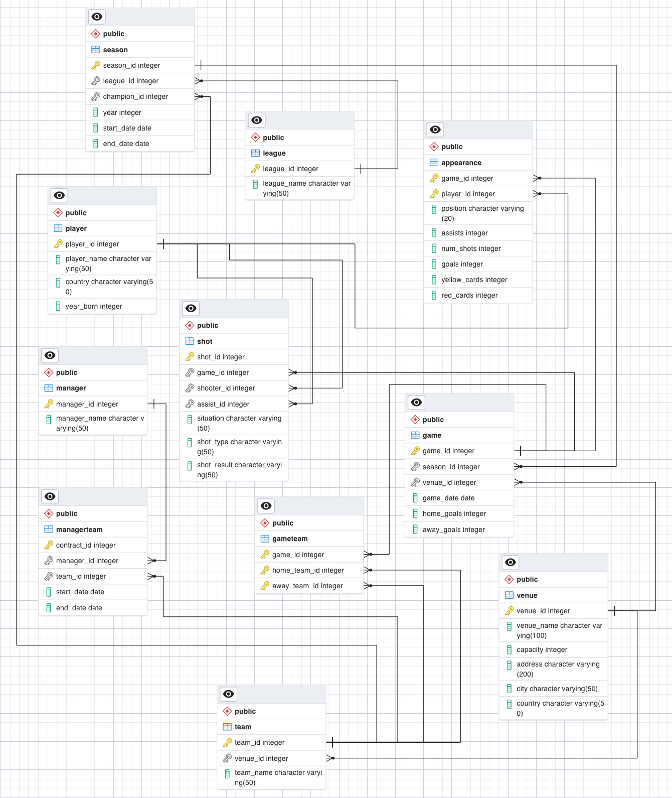
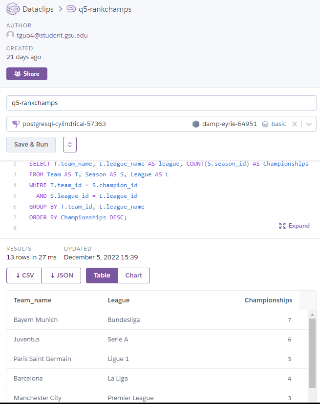
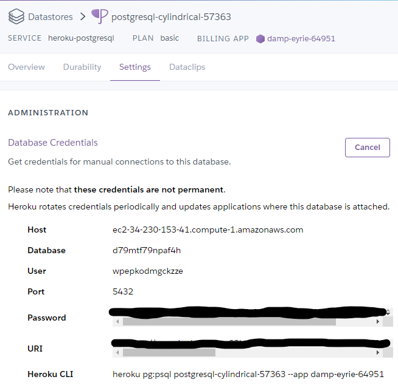
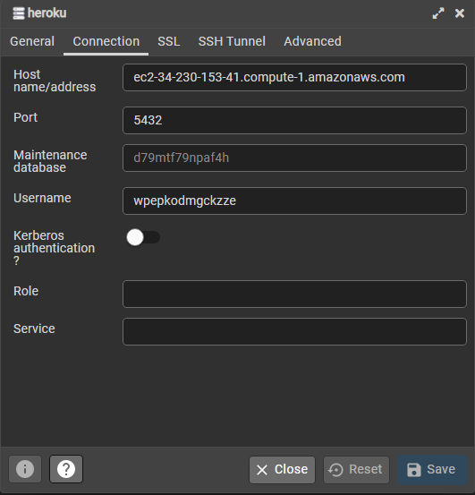
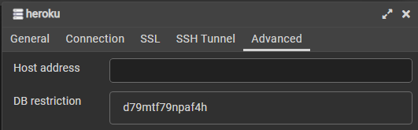

# database-grad-project-fall-22
## INTRODUCTION
This project organizes data from a Kaggle dataset that consists of information
about teams, players, and games from European football. The dataset focuses on the top five
European leagues for the 2014-2020 seasons which includes Premier League of England,
Serie A of Italy, Bundesliga of Germany, La Liga of Spain, and Ligue 1
of France. The data is organized as a relational model as it
provides an ideal structure for the chosen dataset given the amount of
interactions and relationships among teams, players, and managers over time.

### TECHNOLOGIES

The project was created with:

* Python v3.8
* Pandas
* Numpy
* PostgreSQL using Heroku PostgreSQL deployment

## Using The Database

The owner of the Heroku app can directly access and query the database using the dataclip function default to the Heroku Postgresql add-on, see Figure [1].
  

Other users can also query the football database by connecting through pgAdmin. The following information is needed to connect to the database and can be found in the 'Settings' tab of the Heroku web dashboard, see Figure [2].

* Host

* Database Name

* User

* Port

The corresponding location to fill into PgAdmin 'register database'
wizard is shown in Figure [3]. 
Additionally, the visibility of the database needs to be restricted by adding the database name to the 'DB restriction' item under the advanced tab, see Figure [4].  
The database is now loaded to pgAdmin and the credentials can be saved to reconnect to the database as needed.

## Web UI (Under Construction)

A Flask-based web user interface was created to provide easy data manipulation utilizing the Python Flask-SQLalchemy to directly query the database. For the limited amount of project time, the web-based user interface only has the capability able to add a new manager to the database, but all additions and deletions are consistent for all tables.

[Link to the App](https://damp-eyrie-64951.herokuapp.com/)
